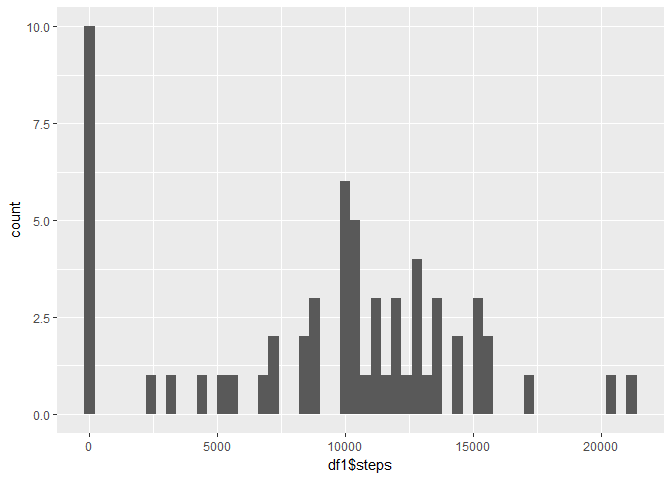
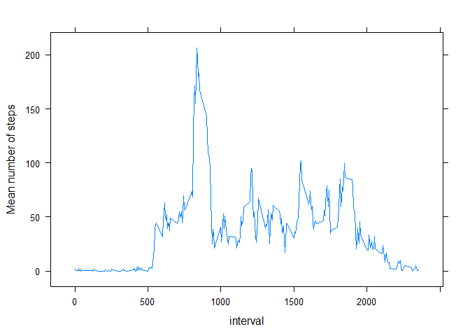
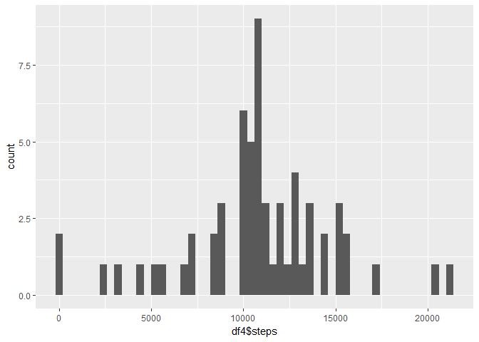
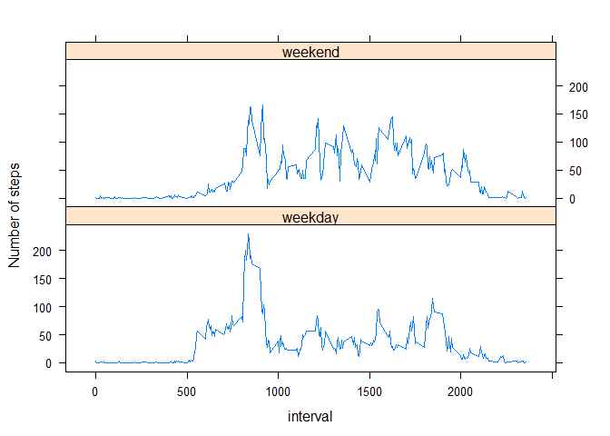

## Loading and preprocessing the data

First, we load any necessary libraries and read the data in from its file.

```r
library(dplyr)
```

```
## Warning: package 'dplyr' was built under R version 3.4.3
```

```
## 
## Attaching package: 'dplyr'
```

```
## The following objects are masked from 'package:stats':
## 
##     filter, lag
```

```
## The following objects are masked from 'package:base':
## 
##     intersect, setdiff, setequal, union
```

```r
library(ggplot2)
library(lattice)
data <- read.csv("activity.csv")
```

## What is mean total number of steps taken per day?

We group the data by date so we can then compute the total number of steps taken for each day. A quick call to the data frame shows that we have a 61 X 2 object, one row for each date in the two month period, and it shows the total number of steps recorded for each day.
After that, we plot a histogram showing the frequencies of different numbers of steps taken per day. A bin width of around 400 gives a bell curve shape with sevaral days listed as having zero steps taken.
Finally, we use the mean() and median() functions to get the mean and median number of steps taken per day.

```r
df1 <- group_by(data, date) %>% summarize(steps = sum(steps, na.rm = TRUE))
df1
```

```
## # A tibble: 61 x 2
##          date steps
##        <fctr> <int>
##  1 2012-10-01     0
##  2 2012-10-02   126
##  3 2012-10-03 11352
##  4 2012-10-04 12116
##  5 2012-10-05 13294
##  6 2012-10-06 15420
##  7 2012-10-07 11015
##  8 2012-10-08     0
##  9 2012-10-09 12811
## 10 2012-10-10  9900
## # ... with 51 more rows
```

```r
qplot(df1$steps, binwidth = 400)
```

<!-- -->

```r
mean_steps <- mean(df1$steps)
med_steps <- median(df1$steps)

print(paste("Mean number of steps per day:", round(mean_steps, 2)))
```

```
## [1] "Mean number of steps per day: 9354.23"
```

```r
print(paste("Median number of steps per day:", med_steps))
```

```
## [1] "Median number of steps per day: 10395"
```


## What is the average daily activity pattern?

For the next part, we need to group the data by interval rather than date, so we'll create a new dataframe from the original data using group_by() and summarize(). We compute the mean number of steps taken for each interval and plot them against the intervals using xyplot(). Finally, we want to find the interval that contains the maximum average number of steps, so we use a boolian within the which() function to return that interval.

```r
df2 <- group_by(data, interval) %>% summarize(steps = mean(steps, na.rm = TRUE))
xyplot(steps ~ interval, data = df2, type = "l", ylab = "Mean number of steps")
```

<!-- -->

```r
df2$interval[which(df2$steps == max(df2$steps))]
```

```
## [1] 835
```


## Inputing missing values
Here, sum(is.na) tells us how many missing values we have for our data:

```r
sum(is.na(data$steps))
```

```
## [1] 2304
```

This code here will recreate the data set but with the mean number of steps for each interval replacing any missing values. Using is.na(), we look at only the rows that are missing an entry for the steps variable. With replace, we get the intervals that correspond to the missing data, and look for the mean number of steps for those intervals, which are already stored in the last dataframe.

```r
df3 <- data
df3$steps[is.na(df3$steps)] <- replace(df3$steps[is.na(df3$steps)], df3$interval[is.na(df3$steps)] %in% df2$interval, df2$steps)

# This will group the rows by date, so we can get a total number of steps taken each day
df4 <- group_by(df3, date) %>% summarize(steps = sum(steps, na.rm = TRUE))

# This will generate a histogram of the number of steps taken each day
qplot(df4$steps, binwidth = 400)
```

<!-- -->

```r
mean_steps <- mean(df4$steps)
med_steps <- median(df4$steps)

print(paste("Mean number of steps per day:", round(mean_steps, 2)))
```

```
## [1] "Mean number of steps per day: 10766.19"
```

```r
print(paste("Median number of steps per day:", med_steps))
```

```
## [1] "Median number of steps per day: 10766.1886792453"
```


## Are there differences in activity patterns between weekdays and weekends?

In order to group the data by weekdays and weekends, we create a new variable called day using the weekdays() and as.Date() functions. From there, we can create a second new variable called day_type and set it initially equal to "weekday". Then, we set all the day_type entries for rows that fall on a Saturday or Sunday equal to "weekend", and then turn the day_type variable into a factor variable. We group by both day_type and interval to get the mean number of steps taken for each interval, for each day_type. Using xyplot(), we show the difference in activity between weekdays and weekends.

```r
df3$day <- weekdays(as.Date(df3$date))
df3$day_type <- "weekday"
df3$day_type[df3$day == "Sunday" | df3$day == "Saturday"] <- "weekend"
df3$day_type <- as.factor(df3$day_type)
df5 <- group_by(df3, day_type, interval) %>% summarize(steps = mean(steps))
xyplot(steps ~ interval | day_type, data = df5, type = "l", layout = c(1, 2), ylab = "Number of steps")
```

<!-- -->
